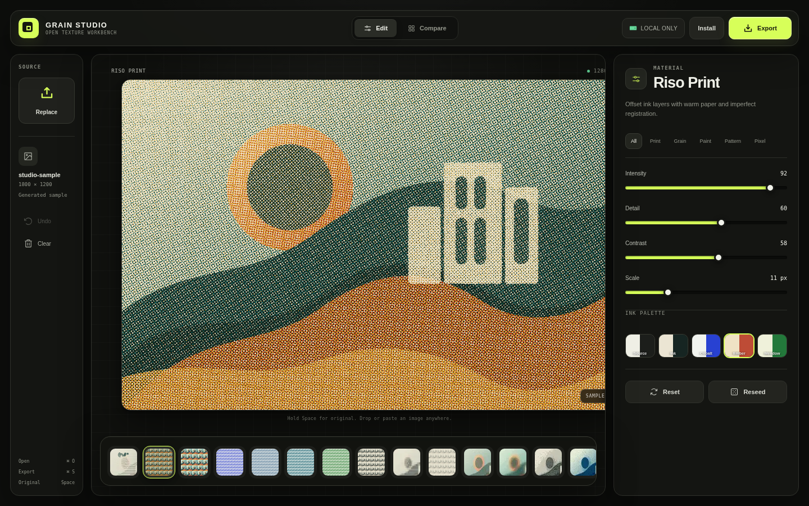

# Grain Studio

A local-first, open-source image texture workbench. Drop in a PNG, JPEG, or WebP, choose one of 25 tactile effects, tune the material, compare it with the source, and export a fresh image.

**Live app:** https://grain-studio-one.vercel.app



## Why this exists

Most online image-effect tools upload files to a server or hide useful controls behind a subscription. Grain Studio performs its rendering in the browser and is designed to remain useful offline after installation.

## Features

- 25 original texture effects across print, grain, paint, pattern, and pixel categories
- File picker, drag and drop, and clipboard paste
- Live intensity, detail, contrast, scale, palette, and seed controls
- Before and after comparison scrubber
- PNG, JPEG, and WebP export
- Original-size export up to an 8192px longest edge, plus 4096px, 2048px, and 1024px options
- Keyboard shortcuts and accessible controls
- Installable progressive web app with runtime caching
- Local-only processing with no image upload or analytics dependency
- Responsive desktop, tablet, and phone layouts

## Quick start

Requirements: Node.js 20 or newer and pnpm 9 or newer.

```bash
pnpm install
pnpm dev
```

Open `http://127.0.0.1:4173`.

Production checks:

```bash
pnpm test
pnpm build
pnpm preview
```

## Use the editor

1. Start with the included generated sample or choose your own image.
2. Select a texture from the dock. Use Left and Right Arrow to move through the visible category.
3. Tune intensity, detail, contrast, scale, palette, or reseed the grain.
4. Turn on Compare and drag the divider. Hold Space at any time to reveal the original.
5. Choose Export, select format and size, then download the rendered file.
6. Choose Install to add Grain Studio to a supported device.

Keyboard shortcuts:

- `Ctrl/Cmd + O`: choose an image
- `Ctrl/Cmd + S`: open export
- `Space`: temporarily reveal the original
- `Left Arrow` and `Right Arrow`: change texture

## Configure the source link

Set this at build time to show the GitHub button in the app header:

```bash
VITE_REPOSITORY_URL=https://github.com/your-name/grain-studio pnpm build
```

## Architecture

The app has no backend. React manages editor state, while the Canvas 2D renderer works from a downscaled preview and creates a fresh higher-resolution render only during export. See [`docs/ARCHITECTURE.md`](docs/ARCHITECTURE.md) for the processing pipeline and extension guide.

## Design and reference policy

The product behavior was independently implemented after reviewing the public interface of [Textures](https://texture.fayaz.workers.dev/). No source code or branded assets from that application are included.

The tactile surface language and proximity dock are informed by the MIT-licensed [ThreeUI Community](https://github.com/MengTo/threeui). See [`THIRD_PARTY_NOTICES.md`](THIRD_PARTY_NOTICES.md) and [`docs/REFERENCE_AUDIT.md`](docs/REFERENCE_AUDIT.md).

## Contributing

Issues and pull requests are welcome. Read [`CONTRIBUTING.md`](CONTRIBUTING.md) before adding a texture or changing the rendering contract.

## License

MIT. See [`LICENSE`](LICENSE).
