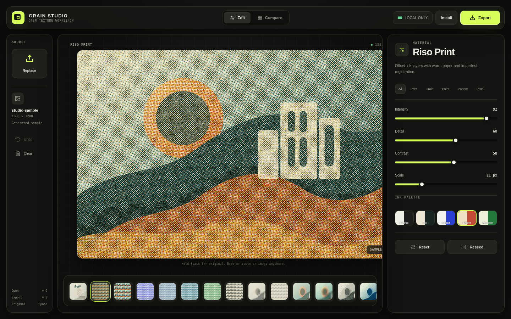

# Grain Studio

A local-first, open-source image texture workbench by **[Harshith Vaddiparthy](https://www.harshith.com/)**. Drop in a PNG, JPEG, or WebP, choose one of 26 tactile effects, tune the material, compare it with the source, and export a fresh image.

**Live app:** https://grainstudio.harshith.com/



## Why this exists

Most online image-effect tools upload files to a server or hide useful controls behind a subscription. Grain Studio performs its rendering in the browser and is designed to remain useful offline after installation.

## Features

- 26 texture effects, including colour-preserving Silver Grain, across print, grain, paint, pattern, and pixel categories
- File picker, drag and drop, and clipboard paste
- Live intensity, detail, contrast, scale, palette, and seed controls
- Before and after comparison scrubber
- PNG, JPEG, and WebP export
- Source-size export within an 8192px longest-edge and 16,777,216-pixel budget, plus 4096px, 2048px, and 1024px options
- Source transparency preserved in PNG/WebP, with an explicit white-background option; JPEG flattens onto white
- Background-worker export with preparing, rendering and encoding states, cancellation and a 60-second limit on supported browsers
- Keyboard shortcuts and accessible controls
- Installable progressive web app with runtime caching
- Local image processing with no image uploads; existing allowlisted product events contain no image identifiers, and respect Do Not Track / Global Privacy Control
- Responsive desktop, tablet, and phone layouts

## Quick start

Requirements: Node.js 20 or newer and pnpm 9 or newer.

```bash
pnpm install
pnpm dev
```

Open `http://127.0.0.1:4173`.

Production checks:

```bash
pnpm test
pnpm build
pnpm preview
```

Browser regressions (requires Python Playwright and Pillow):

```bash
python scripts/verify-quality.py --url http://127.0.0.1:4173
python scripts/verify-plg.py
python scripts/verify-looks.py
```

The quality suite exercises responsive creator credit, image replacement, comparison and actual PNG/WebP/JPEG downloads. Viewport emulation is not a physical-device guarantee.

## Use the editor

1. Start with the included generated sample or choose your own image.
2. Select a texture from the dock. Use Left and Right Arrow to move through the visible category.
3. Tune intensity, detail, contrast, scale, palette, or reseed the grain.
4. Turn on Compare using the stage button on any screen and drag the divider. On a keyboard, hold Space to reveal the original.
5. Choose Export, select format, safe output size and transparency, then download the rendered file. A worker export can be cancelled without discarding your source. Browsers without OffscreenCanvas use a disclosed main-thread fallback limited to 2048px, which cannot be interrupted during synchronous rendering.
6. After exporting your own image, a supported browser may offer installation. The editor remains account-free.
7. Use Save look to keep settings in this browser, or Copy link to share settings without your image.

Keyboard shortcuts:

- `Ctrl/Cmd + O`: choose an image
- `Ctrl/Cmd + S`: open export
- `Space`: temporarily reveal the original
- `Left Arrow` and `Right Arrow`: change texture

## Configure the source link

Set this at build time to show the GitHub button in the app header:

```bash
VITE_REPOSITORY_URL=https://github.com/your-name/grain-studio pnpm build
```

## Architecture

The image editor has no backend. React manages editor state, while the Canvas 2D renderer works from a downscaled preview. Supported browsers create a bounded higher-resolution render in a dedicated OffscreenCanvas worker for export. See [`docs/ARCHITECTURE.md`](docs/ARCHITECTURE.md) for the processing pipeline and extension guide.

## Design and reference policy

The product behavior was independently implemented after reviewing the public interface of [Textures](https://texture.fayaz.workers.dev/). No source code or branded assets from that application are included.

The tactile surface language and proximity dock are informed by the MIT-licensed [ThreeUI Community](https://github.com/MengTo/threeui). See [`THIRD_PARTY_NOTICES.md`](THIRD_PARTY_NOTICES.md) and [`docs/REFERENCE_AUDIT.md`](docs/REFERENCE_AUDIT.md).

## Contributing

Issues and pull requests are welcome. Read [`CONTRIBUTING.md`](CONTRIBUTING.md) before adding a texture or changing the rendering contract.

## License

Created and maintained by **Harshith Vaddiparthy**. MIT. See [`LICENSE`](LICENSE). No attribution watermark is imposed on exported images.
